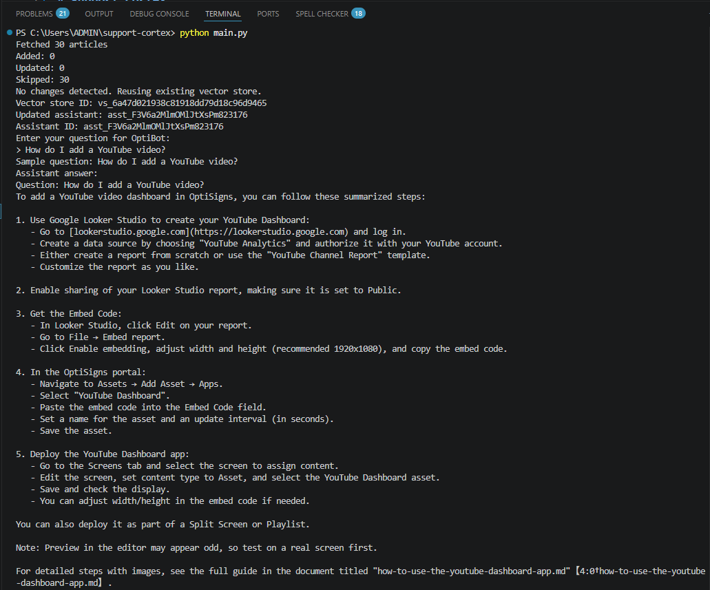

# Support Cortex

A mini-clone of OptiBot that scrapes OptiSigns Help Center articles, converts them into Markdown, uploads them to OpenAI Vector Store, and provides a retrieval-based AI assistant with automated daily synchronization.

## Setup

### Prerequisites

- Python 3.12+
- Docker
- OpenAI API key

### Environment Variables

Create a `.env` file:

```env
OPENAI_API_KEY=your_api_key
OPENAI_VECTOR_STORE_ID=your_vector_store_id
OPENAI_ASSISTANT_ID=your_assistant_id
```

### Install Dependencies

```bash
pip install -r requirements.txt
```

---

## How to Run Locally

Run the complete pipeline in interactive mode:

```bash
python main.py
```

Run the sync/update pipeline without prompting for input:

```bash
python main.py --cron
```

Cron mode can also be enabled with:

```bash
CRON_MODE=true python main.py
```

The pipeline will:

- Fetch OptiSigns support articles
- Convert HTML to Markdown
- Detect added/updated articles using SHA256 hashes
- Upload only changed documents to OpenAI Vector Store
- Update the OpenAI Assistant
- Prompt for questions in interactive mode and return answers with citations
- Skip user input in cron mode

Example output:

```text
Fetched 30 articles
Added: 0
Updated: 0
Skipped: 30
No changes detected. Reusing existing vector store.
```

---

## Daily Job Deployment

The project is deployed as a scheduled Render Cron Job running once per day.

Daily job logs: Daily job execution screenshots are provided in the repository under `/docs`.

Example successful execution:

```text
==> Cron job run started
Fetched 30 articles
Added: 0
Updated: 0
Skipped: 30
No changes detected. Skipping vector store upload.
==> Cron job run finished successfully
```

---

## Assistant Screenshot

Question:

> How do I add a YouTube video?

Screenshot:

docs\assistant-answer.png


---

## Notes

- Knowledge base consists of 30+ OptiSigns Help Center articles.
- Incremental synchronization uses SHA256 hashing.
- OpenAI Vector Store default chunking strategy is used.
- Only newly added or updated articles are uploaded during scheduled runs.
